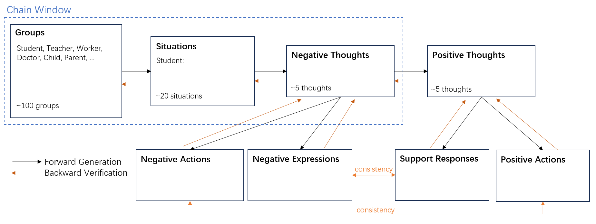

#  Chain of Cognitive
Chain of Cognitive from Negative to Positive

## Overview


## Todo List

 - [] Fetch data from OpenAI
   - [x] Fetch different groups
   - [x] Fetch situtations
   - [x] Fetch negative thoughts
   - [x] Fetch positive thoughts
   - []  Fetch Responses
   - []  Fetch Actions
 - [] Backward checking
 - [] Model Training


## Contribution

Feel free to contribute to this project! Whether it's through improving the model, adding features, or simply providing feedback, all contributions are welcomed and appreciated.

## Citation
If you feel it is useful, please cite the data you used and this item:
```bibtex
@misc{jiang-emola-2023,
    author = {Gongyao Jiang},
    title = {Chain of Cognitive from Negative to Positive},
    year = {2023},
    publisher = {GitHub},
    journal = {GitHub repository},
    howpublished = {\url{https://github.com/Zzoay/Chain-of-Cognitive}}}
}
```

